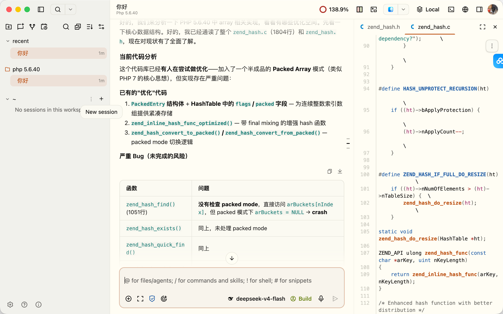

# Hao Work

Hao Work 是一个 AI 编程工作台，也是一套模型自适应 harness 的实验平台。

不同模型擅长的提示方式、工具组合和推理节奏并不相同。Hao Work 希望用可重复的评测，为每种模型匹配合适的 system prompt、工具、推理参数、上下文管理和验证流程，让模型按自己擅长的方式完成长任务。

当前版本以 [OpenChamber](https://github.com/openchamber/openchamber) 为界面和桌面运行基础，以 [HaoCode](https://github.com/skvdhshuk-blip/hao-code) 为 Agent 引擎。它保留会话、文件、工具调用、权限确认和终端等桌面体验，并通过兼容层把现有界面协议转换为 HaoCode SDK 调用。

<p align="center">
  
</p>

## 当前能力

- HaoCode 持久会话、多轮对话，以及流式文本与思考输出
- Read、Write、Edit、apply_patch、Glob、Grep、Bash、Skill 与 Memory 等工具事件展示
- Bash、文件写入和编辑操作的权限确认，支持 ask、smart、auto 三种 HITL 模式与“始终允许”规则
- AskUserQuestion 问答、中断恢复，以及自动决策历史记录
- Anthropic、OpenAI、DeepSeek、GitHub Copilot 等内置 Provider，自定义 OpenAI 兼容 Provider，以及 API Key / OAuth 登录
- 按 Provider 或模型配置图片处理策略：原生视觉、离线 OCR、图片描述、VLM 转述或丢弃
- 可选的 tokimo VM 沙箱配置与桌面端运行时打包
- 项目、会话、消息、Provider 与行为设置持久化到 `~/.config/hao-work`
- macOS、Windows 与 Linux 的 Electron 打包结构和自动更新能力

兼容层目前只实现 Hao Work 主链路所需的 OpenCode API。OpenChamber 中依赖 OpenCode 专有后端能力的边缘功能可能尚未映射，新增映射时应在 `packages/web/server/lib/haocode/compat-server.test.js` 补回归测试。

## 架构

```text
OpenChamber React UI
        │ OpenCode-shaped HTTP / SSE / WebSocket
        ▼
HaoCode compatibility server (Node.js)
        │ one JSON request + JSON-lines events
        ▼
PHP bridge worker
        │
        ▼
sk-wang/hao-code
```

- `packages/ui`：沿用并扩展 OpenChamber 的 React UI。
- `packages/web/server/lib/haocode`：HaoCode 兼容服务、状态存储、图片转换与 PHP worker 管理。
- `packages/haocode-bridge`：PHP 与 Node.js 之间的 JSON-lines 边界。
- `packages/electron`：桌面壳、图标、自动更新和内置运行时打包。

## 本地开发

要求：Bun、Node.js 22+、Composer，以及 PHP 8.3+。

```bash
bun install
composer install --working-dir=packages/haocode-bridge
bun run dev
```

默认页面为 `http://127.0.0.1:5180`，API 服务为 `http://127.0.0.1:3902`。在 Settings → Providers 中保存 Provider 凭据后即可创建会话。

开发时可覆盖 bridge 运行环境：

```bash
HAOWORK_PHP_BINARY=/absolute/path/to/php \
HAOWORK_HAOCODE_WORKER=/absolute/path/to/worker.php \
HAOWORK_HAOCODE_AUTOLOAD=/absolute/path/to/vendor/autoload.php \
bun run dev
```

## 验证与测试

提交前运行统一质量门：

```bash
bun run check
bun run build
```

`bun run check` 会执行全仓类型检查、lint，以及以下核心回归套件：

- 发布工作流、package scripts 与桌面产物命名契约测试
- HaoCode 兼容层、状态存储、worker 协议和图片转换测试
- PHP bridge 的 Node 测试
- Electron 架构与自动更新测试

也可以只运行某一层：

```bash
bun run test:release-contract
bun run test:haocode
bun run test:bridge
bun run test:electron
```

兼容层测试使用假 worker，不消耗模型额度；真实模型联调需要在本地 Provider 设置中保存凭据。Pull Request、`main` 分支提交和 `v*` 发布标签会在 GitHub Actions 中执行同一套 `release:prepare` 质量门。

## 桌面运行与打包

```bash
# Electron 开发模式
bun run electron:dev

# 准备当前平台的轻量 PHP + HaoCode bridge
bun run --cwd packages/electron prepare:haocode-runtime

# 完整打包
bun run electron:build
```

`prepare:haocode-runtime` 会执行以下操作：

1. 按 `packages/haocode-bridge/composer.lock` 安装 HaoCode。
2. 从 NativePHP `php-bin` 下载与当前平台/架构匹配的静态 PHP 8.4，并用 GitHub blob SHA 校验。
3. 把 PHP、bridge、Composer vendor、沙箱 runner 和运行清单写入 Electron resources。

这些资源只在构建阶段生成，不提交到 Git。最终用户安装打包产物后，不需要另装 OpenCode、Tokimo、Composer 或系统 PHP。

## 运行边界

- `caption` 图片策略首次使用时需要下载模型；`ocr` 使用随包提供的离线模型。
- 启用 tokimo 沙箱前必须先准备有效的 rootfs 和对应平台 runner；配置不完整时会保持关闭。
- Provider 真实请求、OAuth 和发布签名仍需要各自的外部凭据，默认回归测试不会访问模型 API。

## Provider 环境变量

Hao Work 优先使用在界面中保存的本地凭据，也兼容各内置 Provider 定义中的环境变量，例如：

- `ANTHROPIC_API_KEY`
- `OPENAI_API_KEY`
- `DEEPSEEK_API_KEY`
- `OPENROUTER_API_KEY`
- `GROQ_API_KEY`
- `GITHUB_TOKEN`（GitHub Copilot 登录时会先交换为短期 Copilot token）

密钥只保存在本机运行状态中，不要写入仓库或发布产物。

## 致谢与许可

Hao Work 基于 OpenChamber 二次开发，并保留其 MIT License 与原作者版权声明。Hao Work 新增的 HaoCode 集成同样按本仓库的 MIT License 发布。
